<div align="center">

# Instituto Tecnológico Nacional de México
### Instituto Tecnológico de Oaxaca

**Carrera:** Ingeniería en Sistemas Computacionales<br><br><br><br>
**Materia:** Programación Web<br><br><br><br>
**Unidad:** Unidad 2<br><br><br><br>
**Docente:** Adelina Martínez Nieto<br><br><br><br>
**Alumno:** Enríquez Rodríguez Alejandro Guillermo<br><br><br><br><br>
**Fecha de entrega:** 04 de julio del 2026<br><br><br><br>

</div>
---

# Utilería.js — Validaciones y Cálculos para Formularios Web

## ¿Qué problema resuelve?

Cada vez que se construye un formulario desde cero, se termina escribiendo el mismo código una y otra vez: validar que el correo tenga formato correcto, revisar que la contraseña sea segura, calcular la edad a partir de una fecha, checar que un teléfono tenga la longitud correcta. Reescribir esto en cada proyecto es perder tiempo y es fácil equivocarse.

**Utileria.js** junta todas estas validaciones y cálculos en un solo archivo reutilizable, para que cualquier formulario pueda usarlo simplemente enlazando el script, sin duplicar lógica ni reinventar la rueda cada vez.

Además de validar datos personales, la librería incluye dos calculadoras prácticas: un cálculo de **Índice de Masa Corporal (IMC)** y un **presupuesto personal** basado en la regla 50/30/20 (necesidades, gustos y ahorro).

---

## Estructura del proyecto

```
utileria/
├── README.md
├── index.html          → Formulario de registro + calculadora de IMC y presupuesto + modal
├── login.html           → Página de inicio de sesión
├── css/
│   └── styles.css       → Estilos del formulario, login y modal
├── img/
│   └── (capturas y recursos visuales)
└── js/
    ├── utileria.js       → Librería de funciones de validación y cálculo
    ├── index.js          → Lógica del formulario de registro
    └── login.js          → Lógica del formulario de login
```

---

## Instalación

No requiere ningún gestor de paquetes ni proceso de compilación. Basta con copiar `utileria.js` a la carpeta `js/` de tu proyecto y enlazarlo antes que el script que lo va a usar:

```html
<script src="js/utileria.js"></script>
<script src="js/index.js"></script>
```

---

## Uso y funciones disponibles

### 1. `validarCorreo(correo)`

Verifica que una cadena tenga formato de correo válido: debe tener exactamente un `@`, un nombre de usuario antes de él, y un dominio con al menos un punto después.

```javascript
validarCorreo("alumno@itoaxaca.edu.mx");   // true
validarCorreo("usuario@dominio.com");      // true

validarCorreo("sin-arroba.com");           // false
validarCorreo("usuario@");                 // false
validarCorreo("");                         // false
```

---

### 2. `soloLetras(texto)`

Revisa que un texto contenga únicamente letras (incluyendo acentos y ñ) y espacios, útil para validar campos de nombre.

```javascript
soloLetras("Alejandro Guillermo");   // true
soloLetras("José Ñáñez");            // true

soloLetras("Alejandro123");          // false
soloLetras("");                      // false
```

---

### 3. `ValidarLongitud(numero, maxLongitud)`

Comprueba que un número (por ejemplo un teléfono) no exceda una cantidad máxima de dígitos.

```javascript
ValidarLongitud("9511234567", 10);   // true  → 10 dígitos
ValidarLongitud("95112345678", 10);  // false → 11 dígitos
```

---

### 4. `calcularEdad(fechaNacimiento)`

Calcula la edad exacta en años a partir de una fecha de nacimiento, tomando en cuenta si ya pasó el cumpleaños de este año.

```javascript
calcularEdad("2000-01-15");   // 26
calcularEdad("2010-12-25");   // 15
```

---

### 5. `esMayorDeEdad(fechaNacimiento)`

Usa `calcularEdad()` internamente para determinar si una persona ya cumplió 18 años.

```javascript
esMayorDeEdad("2000-01-15");   // true
esMayorDeEdad("2015-06-20");   // false
```

---

### 6. `validarPassword(password)`

Valida que una contraseña cumpla con requisitos mínimos de seguridad: al menos 8 caracteres, una mayúscula, una minúscula, un número y un carácter especial.

```javascript
validarPassword("Segura#2026");   // true
validarPassword("clave123");      // false → sin mayúscula ni carácter especial
```

---

### 7. `calcularIMC(altura, peso)` — función propia

Calcula el Índice de Masa Corporal a partir de la altura (en metros) y el peso (en kg), y devuelve tanto el valor numérico como la categoría correspondiente.

```javascript
calcularIMC(1.70, 65);
// { imc: 22.49, respuesta: "Peso normal" }

calcularIMC(1.60, 90);
// { imc: 35.15, respuesta: "Obesidad" }
```

---

### 8. `calcularPresupuesto(ingresoTotal)` — función propia

Divide un ingreso total según la regla de presupuesto 50/30/20: 50% para necesidades, 30% para gustos y 20% para ahorro.

```javascript
calcularPresupuesto(10000);
// {
//   ingreso_total: 10000,
//   necesidades_50: 5000,
//   gustos_30: 3000,
//   ahorro_20: 2000
// }
```

---

## Integración real en el proyecto

### Formulario de registro (`index.html`)

El formulario valida nombre, fecha de nacimiento y teléfono en tiempo real (evento `blur`), y al presionar el botón "Verificar" ejecuta todas las validaciones antes de mostrar los resultados en un modal.

```javascript
botonValidar.addEventListener("click", function () {
    let nombre = campoNombre.value;
    let fecha = campoFecha.value;
    let telefono = campoTelefono.value;

    let valido = true;

    if (!soloLetras(nombre)) {
        errorNombre.textContent = "Solo letras y espacios.";
        valido = false;
    }

    if (!ValidarLongitud(telefono, 10)) {
        errorTelefono.textContent = "Máximo 10 dígitos.";
        valido = false;
    }

    if (!valido) {
        return;
    }

    let edad = calcularEdad(fecha);
    let mayorEdad = esMayorDeEdad(fecha);

    modalFondo.classList.add("activo");
});
```

### Calculadora de IMC y presupuesto

En el mismo formulario, si el usuario ingresa altura, peso e ingreso total, el sistema calcula ambos resultados y los muestra directamente en los campos de resultados:

```javascript
if (altura > 0 && peso > 0) {
    let resultadoIMC = calcularIMC(altura, peso);
    document.getElementById("imc").value = resultadoIMC.imc.toFixed(2);
    document.getElementById("categoriaImc").value = resultadoIMC.respuesta;
}

if (dinero > 0) {
    let presupuesto = calcularPresupuesto(dinero);
    document.getElementById("necesidad").value = presupuesto.necesidades_50;
    document.getElementById("gustos").value = presupuesto.gustos_30;
    document.getElementById("ahorro").value = presupuesto.ahorro_20;
}
```

### Inicio de sesión (`login.html`)

El login valida correo y contraseña con las mismas funciones de la librería, y muestra un mensaje de éxito si ambos son válidos.

```javascript
botonIniciar.addEventListener("click", function () {
    let usuario = campoUsuario.value;
    let password = campoPassword.value;

    let correoOk = validarCorreo(usuario);
    let passwordOk = validarPassword(password);

    if (correoOk && passwordOk) {
        badgeExito.classList.add("activo");
    } else {
        badgeExito.classList.remove("activo");
    }
});
```

---

## Capturas de pantalla — Consola mostrando resultados

### validarCorreo
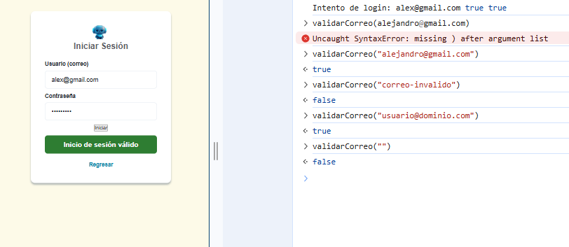

### soloLetras
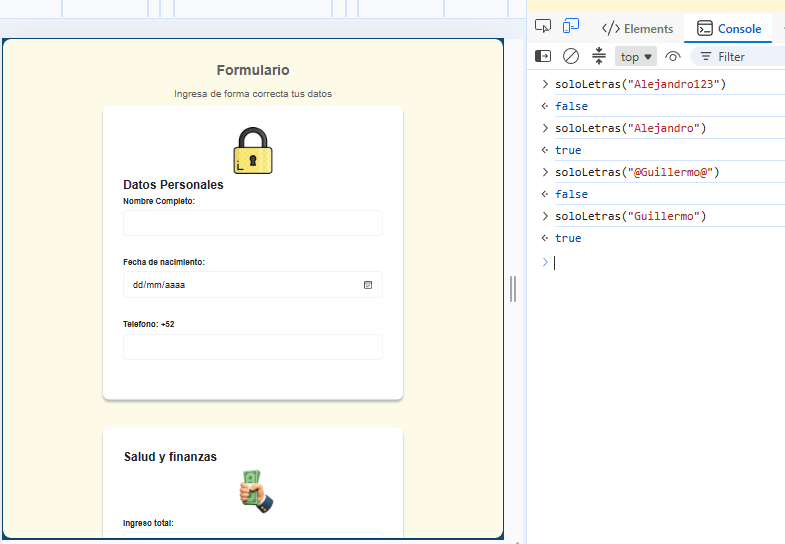

### ValidarLongitud
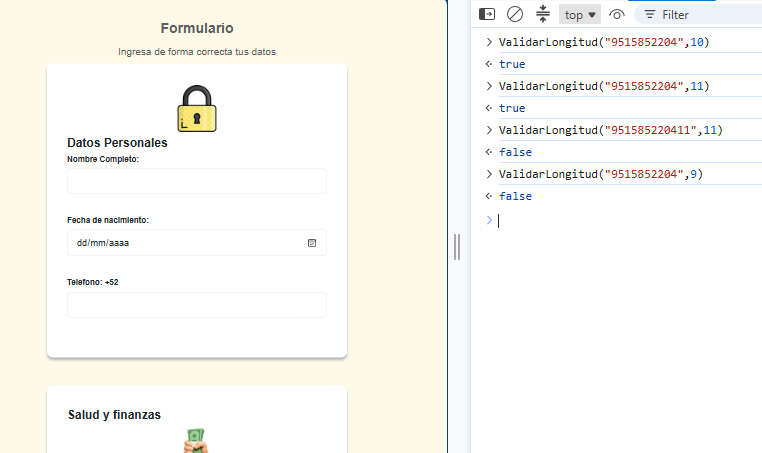

### calcularEdad
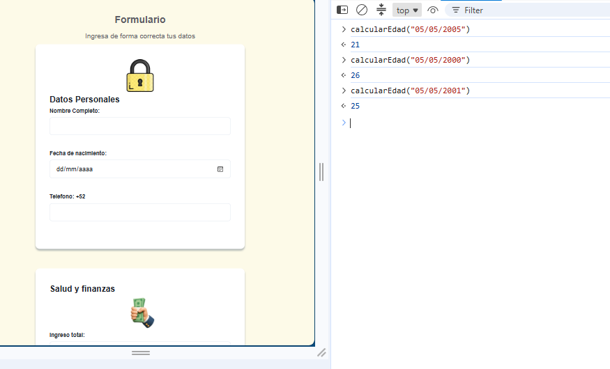

### esMayorDeEdad
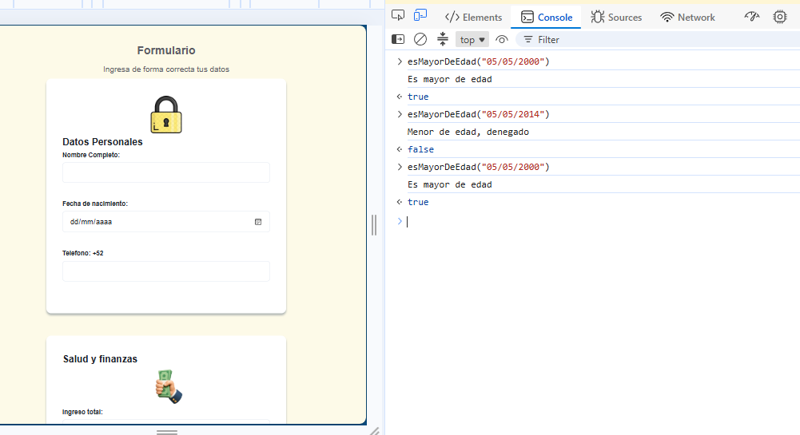

### validarPassword
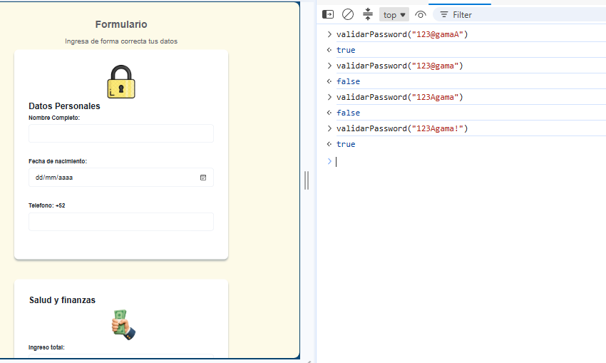

### calcularIMC
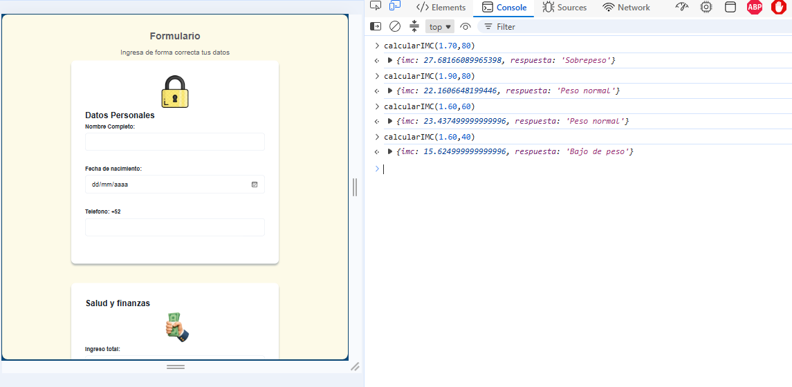

### calcularPresupuesto
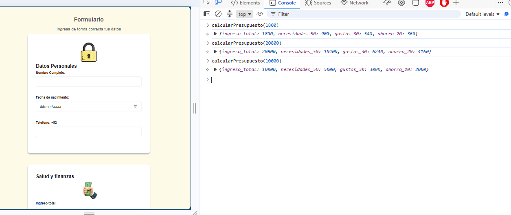

---


## Capturas de pantalla
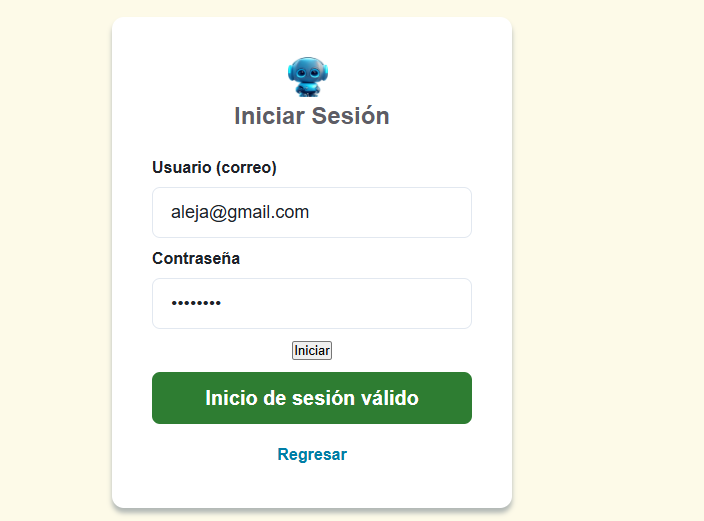
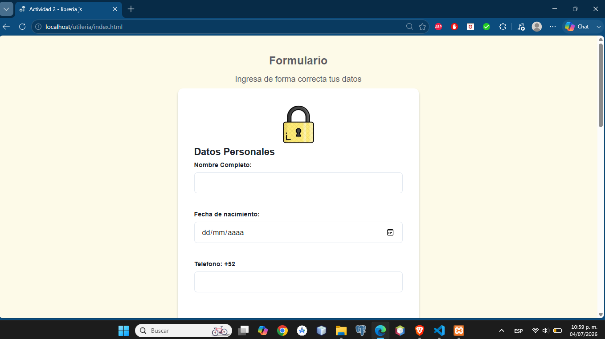
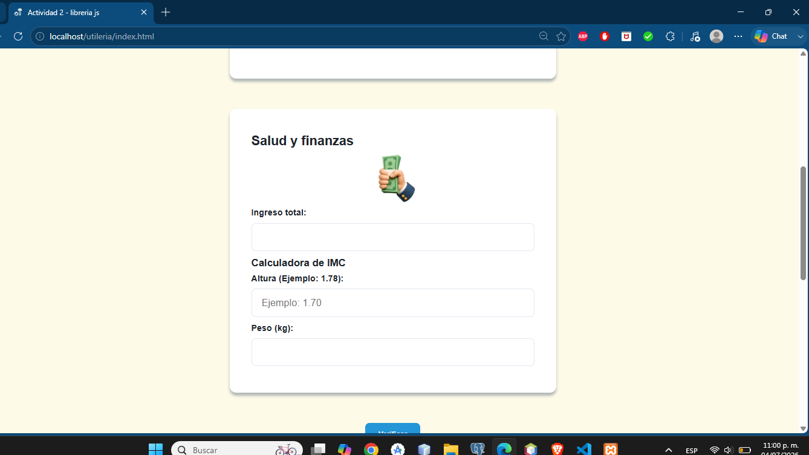
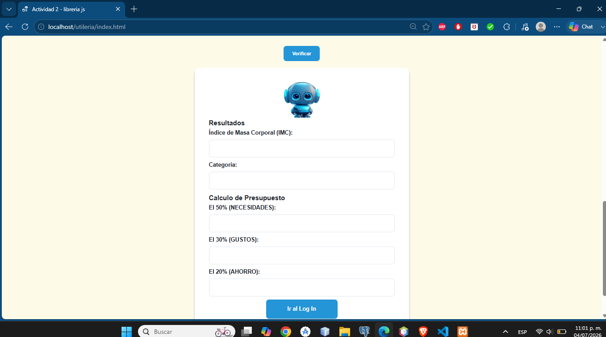

---
## Tecnologías utilizadas

- **HTML5** — estructura del formulario, login y modal
- **CSS3** — estilos, diseño responsivo y animaciones del modal
- **JavaScript vanilla** — sin frameworks ni dependencias externas

---

## Video demostrativo

[Ver video demo](https://youtu.be/FpdFwzPBnqE)

---

## Autor

**Enríquez Rodríguez Alejandro Guillermo**

Librería de utilería en JavaScript para validación de formularios y cálculos personales.
